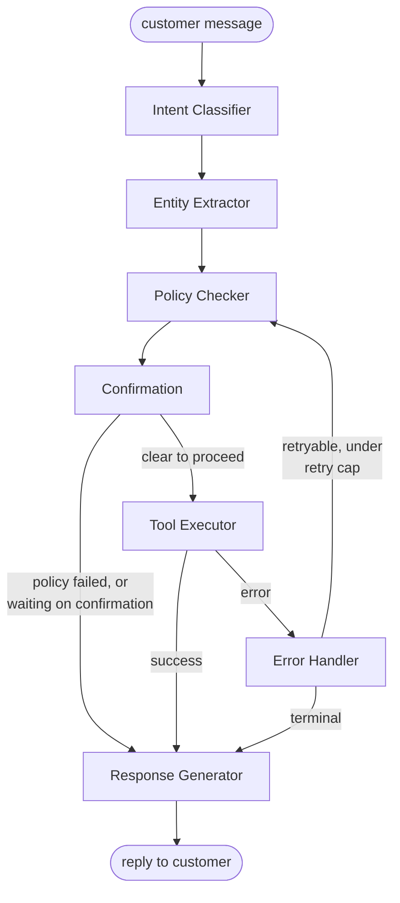

# Ticket Booking Agent

A customer-service agent for a travel platform that handles three kinds of requests —
**booking** a ticket, **inquiring** about an existing booking/schedule, or requesting a
**refund/cancellation** — via tool-calling against a local SQLite database. Built with
**LangGraph** and **Groq** (`llama-3.1-8b-instant`).

This repo contains **two implementations**, explained in full in §5. The short version:
`run_agent.py` is the required submission (the assignment's specified ≥6-node architecture);
`run_agent_react.py` is a bonus second implementation of the same agent as a strict ReAct
loop, included to demonstrate the distinction between the two approaches.

---

## 1. Setup

```bash
pip install -r requirements.txt
python data/seed.py                 # (re)creates data/travel.sqlite from scratch
```

Requires a `.env` file in the project root:
```
GROQ_API_KEY=your_key_here
```

**Run the required pipeline:**
```bash
python run_agent.py --batch sample_questions_eval.jsonl --out outputs.jsonl
python run_agent.py --interactive --customer-id 3
```

**Run the bonus ReAct agent:**
```bash
python run_agent_react.py --batch sample_questions_eval.jsonl --out outputs_react.jsonl
python run_agent_react.py --interactive --customer-id 3
```

---

## 2. Architecture — nodes and edges

The graph (`agent/graph.py`) has 7 nodes, matching the assignment's specified architecture
exactly. `AgentState` (`agent/state.py`) is the shared dict every node reads from and writes
back into.



**The 7 nodes:**

| # | Node | File | LLM? | Job |
|---|---|---|---|---|
| 1 | Intent Classifier | `agent/nodes/intent_classifier.py` | Yes | Labels the message `book` / `inquiry` / `refund` / `out_of_scope` |
| 2 | Entity Extractor | `agent/nodes/entity_extractor.py` | Yes | Pulls out route/booking/payment details actually present in the message — never guesses missing ones |
| 3 | Policy Checker | `agent/nodes/policy_checker.py` | No | Validates against business rules; decides `policy_ok`, why, and whether confirmation is required |
| 4 | Confirmation | `agent/nodes/confirmation.py` | No | Applies the mode rule — batch always auto-confirms, interactive only confirms if a prior turn already said yes |
| 5 | Tool Executor | `agent/nodes/tool_executor.py` | No | The only node that calls the 5 DB tools; decides which one(s) based on intent + entities |
| 6 | Error Handler | `agent/nodes/error_handler.py` | No | The repair loop — retries one specific fixable error type, capped at `MAX_RETRIES = 2`; everything else is terminal |
| 7 | Response Generator | `agent/nodes/response_generator.py` | Yes | Writes the customer-facing reply, using a plain-Python situation classification (declined/needs_confirmation/failed/completed) so it can't claim something happened when it didn't |

**The edges, in words:**
1. `classify_intent → extract_entities → check_policy → confirm` — always, in that order.
2. After `confirm`: if policy failed, **or** confirmation is still pending → straight to
   `generate_response` (nothing gets executed). Otherwise → `execute_tools`.
3. After `execute_tools`: error → `handle_error`. Success → `generate_response`.
4. After `handle_error`: retryable (one specific error type, under the cap) → loops back to
   `check_policy` with adjusted entities. Otherwise → `generate_response`.
5. `generate_response → END`.

**Supporting helper modules** (not nodes, but shared logic multiple nodes/tools use):

| File | Purpose |
|---|---|
| `agent/config.py` | `SIMULATED_NOW` (§4) and `MAX_RETRIES` |
| `agent/db.py` | SQLite connection helper |
| `agent/llm.py` | One shared, cached Groq client (`temperature=0`) |
| `agent/policy.py` | `calculate_refund()` — the refund-percentage math, single source of truth |
| `agent/route_resolver.py` | `resolve_route()` — turns extracted entities into a specific route (exact / ambiguous / not found), shared by Policy Checker and Tool Executor so they always agree |

**The 5 tools** (`agent/tools/`) — each a plain function: validate → read or write → close.
No ORM; raw `sqlite3` with parameterized queries.

| Tool | Type | Guards against |
|---|---|---|
| `search_routes` | read | — |
| `book_ticket` | write | overbooking |
| `get_booking_status` | read | — |
| `request_refund` | write | double-refunding; auto-approves since the % is a fixed rule, not a judgment call |
| `cancel_booking` | write | double-cancelling |

---

## 3. How policies are enforced

**Enforcement lives in plain, deterministic Python — never left to the LLM's judgment.**
`policy_checker.py`, `confirmation.py`, `tool_executor.py`, and `error_handler.py` contain no
LLM calls at all.

- **Refund tiers** (100% / 75% / 50% / 0% by hours-until-departure, +10% loyalty bonus capped
  at 100%) — computed once in `policy.py`'s `calculate_refund()`, called by both
  `policy_checker.py` (to preview/validate before confirming) and `request_refund.py` (to
  actually act). One implementation, so the number shown to the customer and the number
  actually processed can never drift apart.
- **No overbooking** — `policy_checker.py` checks `available_seats > 0` before allowing a
  booking to proceed to confirmation; `book_ticket.py` checks it again independently as a
  final backstop.
- **No double-refunding / double-cancelling** — `request_refund.py` and `cancel_booking.py`
  both check the booking's current `status` before acting and reject if it's already
  `cancelled`/`refunded`.
- **Confirmation required for destructive actions** — `policy_checker.py` sets
  `confirmation_required = True` only for a booking/refund that's actually about to happen
  (not for read-only searches/lookups); `confirmation.py` then applies the batch-vs-interactive
  rule on top of that flag.
- **Out-of-scope requests** — `policy_checker.py` rejects these outright
  (`policy_ok = False`), so no tool is ever called for them.
- **The response can't misrepresent what happened** — `response_generator.py` classifies which
  of 4 situations applies (declined / needs_confirmation / failed / completed) in plain Python
  *before* calling the LLM, and only shows it the facts relevant to that situation. This is
  what stops it from writing "your flight has been booked" when only a search ran.

---

## 4. Assumptions made

- **`SIMULATED_NOW` — a fixed reference date, not the real clock.** The refund policy depends
  on hours-until-departure, but the seed data's departure times are fixed to September 2025 —
  using `datetime.now()` would put every route permanently in the past. `config.py` pins
  `2025-09-13T00:00:00` as "now" for all refund-timing math instead. One consequence worth
  knowing: the agent computes eligibility from the database's actual departure time, not
  whatever the customer claims about urgency — it can't be talked into a bigger refund by
  someone misstating how soon their trip is.
- **Seat numbers are a placeholder, not a real seat map.** `book_ticket.py` generates a label
  from a same-day booking counter, not a per-route seat chart — duplicate seat numbers on the
  same route are possible. Scoped out since it isn't part of the grading criteria.
- **`confidence` is self-reported by the LLM, not a calibrated probability.** It's produced as
  part of the structured-output schema the same way the intent label is — a plausible number
  the model generates, not a measured statistic.
- **The provided `sample_questions_eval.jsonl` references IDs that don't exist in the
  provided seed data** (`BK-20250801-*` and route `EG-101` appear in the eval questions; the
  seed data only creates `BK-20250901-*`–`BK-20250910-*` and routes `EG-201`–`EG-204`). The
  agent correctly reports these as not found — this is a data inconsistency in the assignment
  materials, not an agent bug.
- **Refunds auto-approve rather than entering a `pending` review state**, since the percentage
  is fully determined by a fixed rule — there's no judgment call to defer. Some seed rows *are*
  `pending`, representing refunds requested before this system existed.
- **Booking requires an unambiguous match.** If the customer's stated origin/destination/
  transport-type matches more than one route, the agent presents the options rather than
  guessing — it never books an ambiguous request.
- **`tool_inputs`/`tool_outputs` in the output contract are lists aligned with `tools_called`
  by index, not a dict keyed by tool name.** A dict would silently lose data if the same tool
  were ever called twice in one turn (a dict key would just get overwritten).

---

## 5. Two implementations — required pipeline vs. bonus ReAct agent

The assignment's overview describes a "ReAct-style tool-calling pattern," but its Architecture
section explicitly specifies a fixed ≥6-node pipeline (Intent Classifier → Entity Extractor →
Policy Checker → Tool Executor → Response Generator, plus Confirmation and Error Handler).
That fixed pipeline is **not** strict ReAct — real ReAct doesn't hardcode a stage order; the
LLM decides at each step whether and which tool to call, observes the result, and decides the
next move itself.

Both are included, since they demonstrate different things:

| | `run_agent.py` (required) | `run_agent_react.py` (bonus) |
|---|---|---|
| Graph | `agent/graph.py` — 7 nodes | `agent/react_graph.py` — 2 nodes (`agent`, `tools`) |
| Who decides *whether/which* tool to call | Fixed Python dispatch (`tool_executor.py`'s `if intent == ...`), acting on labels the LLM produced earlier | The LLM itself, via `bind_tools()` — its output *is* the tool call |
| Who decides *when to stop* | Graph structure (fixed number of stages) | The LLM — loops `agent ⟷ tools` until it emits a message with no tool calls |
| Business rules | Explicit code (`policy_checker.py`) | Mostly prompt instructions (`agent/react_prompt.py`), with tool-level checks (seat availability, double-refund guards) as the hard backstop |
| Confirmation | `confirmation.py` node + graph routing | `interrupt()` — the graph physically pauses mid-node, not just the LLM "asking nicely" |
| `intent` / `policy_applied` / `confidence` in output | Directly reported by dedicated nodes | Reconstructed after the fact from which tools were called (`confidence` has no equivalent, always `null`) |
| Satisfies the assignment's explicit ≥6-node requirement | Yes | No — 2 nodes |
